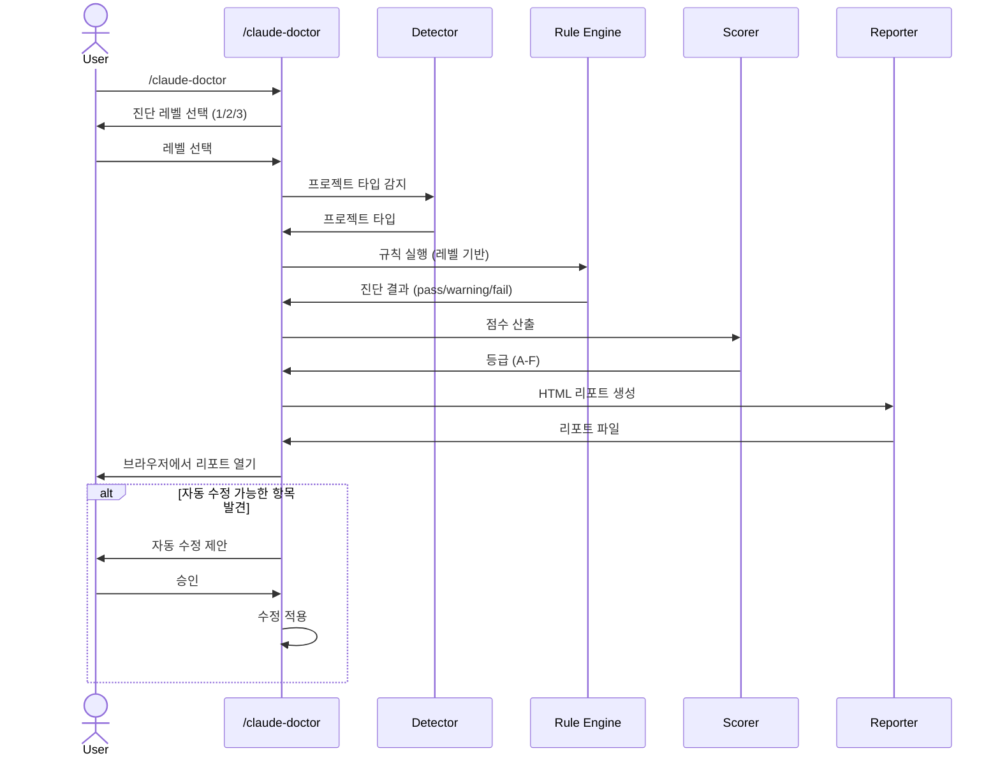

# Claude Code Doctor

> 당신은 Claude Code를 제대로 사용하고 있는가?

Claude Code 설정 파일(CLAUDE.md, settings, skills, agents 등)을 분석하여 개선점을 진단하고, 시각적 HTML 리포트로 결과를 제공하는 진단 스킬입니다.

[English](./README.md)

## 개요

Claude Code Doctor는 Claude Code 설정을 스캔하여 잘못된 구성, 누락된 모범 사례, 최적화 기회를 진단합니다. 등급, 차트, 규칙별 상세 결과가 담긴 HTML 리포트를 생성하며 브라우저에서 자동으로 열립니다.

- **3단계 진단** — 원하는 깊이를 선택하여 분석
- **프로젝트 타입 감지** — 기술 스택을 자동 감지하여 맞춤 추천 제공
- **시각적 HTML 리포트** — 등급, 차트, 상세 결과를 브라우저에서 확인
- **다크/라이트 모드** — 시스템 설정에 따라 자동 전환

## 리포트 미리보기


## 파이프라인 구조



## 진단 레벨

| Level | 범위 | 항목 수 |
|-------|------|---------|
| 1 | CLAUDE.md | 파일 품질, 토큰 효율성, 구조, 중복 (12개 룰) |
| 2 | 스킬/에이전트 | Level 1 + 커스텀 스킬, 에이전트, 메모리 검증 (+8개 룰) |
| 3 | 종합 | Level 2 + settings.json, 권한, 플러그인, hooks (+12개 룰) |

## 등급 기준

| 등급 | 점수 | 의미 |
|------|------|------|
| A | 90-100 | 최적화된 설정 |
| B | 75-89 | 양호, 소소한 개선 가능 |
| C | 60-74 | 보통, 개선 권장 |
| D | 40-59 | 미흡, 개선 필요 |
| F | 0-39 | 기본 설정 누락 다수 |

## 설치

### 스킬로 등록 (심볼릭 링크)

```bash
ln -s /path/to/claude-code-doctor/skills/claude-doctor ~/.claude/skills/claude-doctor
```

### 플러그인으로 설치 (준비 중)

```bash
# Claude Code 플러그인 마켓플레이스를 통해 제공 예정
```

## 사용법

Claude Code 세션에서:

```
/claude-doctor
```

1. 진단 레벨 선택 (1, 2, 3)
2. 분석 완료 대기
3. HTML 리포트가 브라우저에서 자동 오픈
4. 터미널에 요약 출력

## 지원 프로젝트 타입

Next.js, React (Vite), Node.js, Spring Boot, Python, Rust, Go, Generic

## 진단 기준 및 출처

모든 진단 규칙은 **Anthropic 공식 Claude Code 문서**를 기반으로 작성되었습니다. 각 규칙에는 근거를 나타내는 `source` 필드가 포함되어 있습니다:

| Source | 의미 |
|--------|------|
| `official` | Anthropic 공식 문서에서 직접 인용 |
| `derived` | 공식 가이드라인에서 논리적으로 도출 (예: 200줄 규칙을 에이전트 프롬프트에 적용) |
| `best-practice` | 공식 권장사항에 부합하는 업계 모범 사례 |

### 주요 공식 기준

| 기준 | 공식 가이드 | 출처 |
|------|-------------|------|
| CLAUDE.md 줄 수 제한 | **파일당 200줄 이하** — 긴 파일은 컨텍스트를 더 소비하고 준수도가 감소 | [Memory & CLAUDE.md 문서](https://docs.anthropic.com/en/docs/claude-code/memory) |
| CLAUDE.md 구조화 | 마크다운 헤더와 불릿으로 지시사항 그룹화 | [Memory 문서](https://docs.anthropic.com/en/docs/claude-code/memory) |
| CLAUDE.md 구체성 | 구체적으로 작성: "2칸 들여쓰기 사용"(좋음) vs "코드를 적절히 포맷"(나쁨) | [Memory 문서](https://docs.anthropic.com/en/docs/claude-code/memory) |
| CLAUDE.md 계층 구조 | 우선순위: Managed > Local > Project > User. 레벨 간 중복 금지 | [Memory 문서](https://docs.anthropic.com/en/docs/claude-code/memory) |
| CLAUDE.md 제외 | settings.json의 `claudeMdExcludes` 사용 (.claudeignore는 비공식) | [Settings 문서](https://docs.anthropic.com/en/docs/claude-code/settings) |
| SKILL.md 필드 | 모든 frontmatter 필드는 선택사항; `description`(250자)만 권장 | [Skills 문서](https://docs.anthropic.com/en/docs/claude-code/skills) |
| 커맨드 → 스킬 | 커맨드는 레거시이며 스킬로 통합됨 | [Skills 문서](https://docs.anthropic.com/en/docs/claude-code/skills) |
| MEMORY.md 제한 | 인덱스 파일 200줄 / 25KB 로딩 제한 | [Memory 문서](https://docs.anthropic.com/en/docs/claude-code/memory) |
| Settings 우선순위 | Managed > Local > Project > User (4단계 계층) | [Settings 문서](https://docs.anthropic.com/en/docs/claude-code/settings) |
| 권한 설정 | `allow`는 사전 승인, `deny`는 차단. Managed deny는 하위에서 재정의 불가 | [Permissions 문서](https://docs.anthropic.com/en/docs/claude-code/permissions) |
| Hooks | PreToolUse, PostToolUse, SessionStart 이벤트에 셸 명령 자동 실행 | [Hooks 문서](https://docs.anthropic.com/en/docs/claude-code/hooks) |

## 진단 항목

### Level 1: CLAUDE.md

| ID | 항목 | 심각도 | 출처 |
|----|------|--------|------|
| CMD-001 | 글로벌 CLAUDE.md 존재 | Critical | official |
| CMD-002 | 프로젝트 CLAUDE.md 존재 | Warning | official |
| CMD-003 | CLAUDE.md 크기 (200줄 이하) | Warning | official |
| CMD-004 | 섹션 구조화 여부 | Warning | official |
| CMD-005 | 글로벌-프로젝트 중복 | Warning | official |
| CMD-006 | 모호한 지시사항 | Info | official |
| CMD-007 | 토큰 효율성 추정 | Info | derived |
| CMD-008 | 코드 블록 비중 (40% 이하) | Info | best-practice |
| CMD-009 | 프로젝트 CLAUDE.md 크기 (200줄 이하) | Warning | official |
| CMD-010 | 충돌하는 규칙 여부 | Warning | official |
| CMD-011 | .claude/rules/ 디렉토리 활용 | Info | official |
| CMD-012 | CLAUDE.md imports 활용 | Info | official |

### Level 2: 스킬/에이전트

| ID | 항목 | 심각도 | 출처 |
|----|------|--------|------|
| SKA-001 | 커스텀 스킬 존재 | Info | official |
| SKA-002 | 커스텀 에이전트 존재 | Info | official |
| SKA-003 | 커맨드→스킬 마이그레이션 | Warning | official |
| SKA-004 | SKILL.md description 존재 | Warning | official |
| SKA-005 | 에이전트 프롬프트 크기 (200줄 이하) | Warning | derived |
| SKA-006 | allowed-tools 설정 확인 | Warning | official |
| SKA-007 | 메모리 시스템 활용 | Info | official |
| SKA-008 | 스킬 간 allowed-tools 중복/충돌 | Warning | derived |

### Level 3: Settings

| ID | 항목 | 심각도 | 출처 |
|----|------|--------|------|
| SET-001 | settings.json JSON 유효성 | Critical | official |
| SET-002 | 모델 설정 확인 | Info | official |
| SET-003 | permissions.allow 과다 | Warning | official |
| SET-004 | 위험 명령어 허용 여부 | Critical | best-practice |
| SET-005 | deny 목록 설정 | Info | official |
| SET-006 | 플러그인 설치 상태 | Info | official |
| SET-007 | 프로젝트별 설정 분리 | Info | official |
| SET-008 | claudeMdExcludes 설정 | Info | official |
| SET-009 | hooks 설정 여부 | Info | official |
| SET-010 | statusLine 설정 | Info | official |
| SET-011 | settings 파일 간 충돌 감지 | Warning | derived |
| SET-012 | MCP 서버 설정 진단 | Info | official |

## 라이선스

MIT
