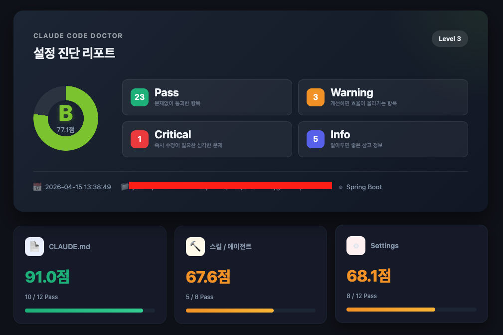
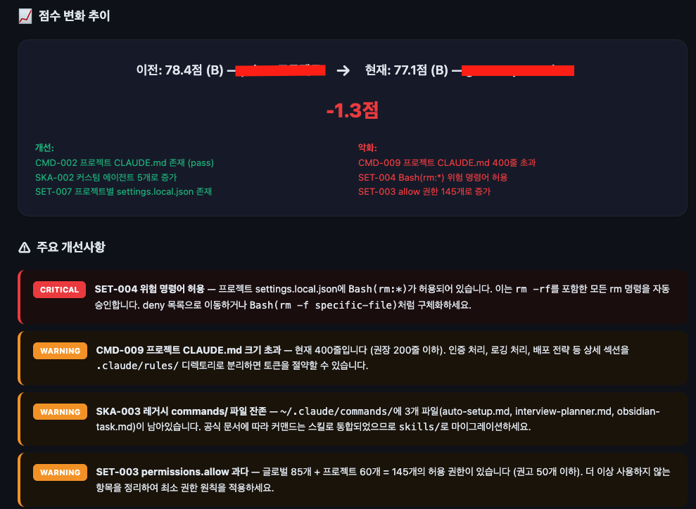
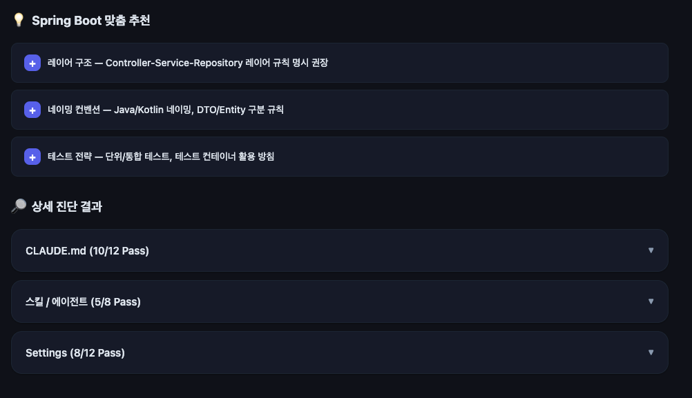
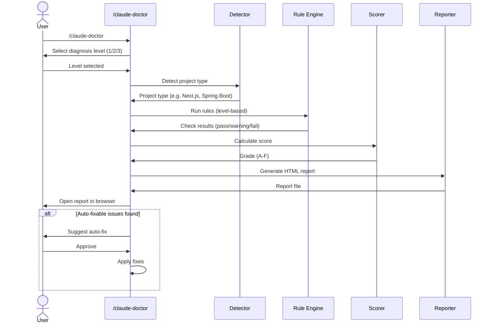

# Claude Code Doctor

> Are you using Claude Code properly?

A diagnostic skill for Claude Code that analyzes your configuration files (CLAUDE.md, settings, skills, agents, etc.) and provides actionable recommendations with a visual HTML report.

[한국어](./README.ko.md)

## Overview

Claude Code Doctor scans your Claude Code setup and diagnoses misconfigurations, missing best practices, and optimization opportunities. It produces an HTML report with grades, charts, and per-rule details — opening automatically in your browser.

- **3-Level Diagnosis** — Choose the depth of analysis
- **Project Type Detection** — Auto-detects your tech stack and provides tailored recommendations
- **Visual HTML Report** — Opens automatically in your browser with grades, charts, and detailed results
- **Dark/Light Mode** — Follows your system preference

## Report Preview







## Pipeline Architecture



## Diagnosis Levels

| Level | Scope | Items |
|-------|-------|-------|
| 1 | CLAUDE.md | File quality, token efficiency, structure, duplicates (12 rules) |
| 2 | Skills & Agents | Level 1 + custom skills, agents, memory validation (+ 8 rules) |
| 3 | Comprehensive | Level 2 + settings.json, permissions, plugins, hooks (+ 12 rules) |

## Grading

| Grade | Score | Meaning |
|-------|-------|---------|
| A | 90-100 | Optimized configuration |
| B | 75-89 | Good, minor improvements possible |
| C | 60-74 | Average, improvements recommended |
| D | 40-59 | Below average, needs attention |
| F | 0-39 | Missing basic configurations |

## Installation

### As a Skill (symlink)

```bash
ln -s /path/to/claude-code-doctor/skills/claude-doctor ~/.claude/skills/claude-doctor
```

### As a Plugin (coming soon)

```bash
# Will be available via Claude Code plugin marketplace
```

## Usage

In a Claude Code session:

```
/claude-doctor
```

1. Select diagnosis level (1, 2, or 3)
2. Wait for analysis to complete
3. HTML report opens automatically in your browser
4. Terminal shows a brief summary

## Supported Project Types

Next.js, React (Vite), Node.js, Spring Boot, Python, Rust, Go, and Generic fallback.

## Standards & Sources

All diagnostic rules are based on **Anthropic's official Claude Code documentation**. Each rule includes a `source` field indicating its basis:

| Source | Meaning |
|--------|---------|
| `official` | Directly from Anthropic's official documentation |
| `derived` | Logically derived from official guidelines (e.g., applying the 200-line rule to agent prompts) |
| `best-practice` | Industry best practices aligned with official recommendations |

### Key Official Standards Applied

| Standard | Official Guidance | Source |
|----------|-------------------|--------|
| CLAUDE.md line limit | **200 lines per file** — longer files consume more context and reduce compliance | [Memory & CLAUDE.md docs](https://docs.anthropic.com/en/docs/claude-code/memory) |
| CLAUDE.md structure | Use markdown headers and bullets to group instructions | [Memory docs](https://docs.anthropic.com/en/docs/claude-code/memory) |
| CLAUDE.md specificity | Be specific: "Use 2-space indentation" (good) vs "Format code properly" (bad) | [Memory docs](https://docs.anthropic.com/en/docs/claude-code/memory) |
| CLAUDE.md hierarchy | Priority: Managed > Local > Project > User. Avoid duplication across levels | [Memory docs](https://docs.anthropic.com/en/docs/claude-code/memory) |
| CLAUDE.md exclusion | Use `claudeMdExcludes` in settings.json (NOT .claudeignore) | [Settings docs](https://docs.anthropic.com/en/docs/claude-code/settings) |
| SKILL.md fields | All frontmatter fields are optional; only `description` (250 chars) is recommended | [Skills docs](https://docs.anthropic.com/en/docs/claude-code/skills) |
| Commands → Skills | Commands are legacy and have been merged into Skills | [Skills docs](https://docs.anthropic.com/en/docs/claude-code/skills) |
| MEMORY.md limits | 200 lines / 25KB loading limit for MEMORY.md index file | [Memory docs](https://docs.anthropic.com/en/docs/claude-code/memory) |
| Settings priority | Managed > Local > Project > User (4-tier hierarchy) | [Settings docs](https://docs.anthropic.com/en/docs/claude-code/settings) |
| Permissions | `allow` for pre-approval, `deny` for blocking. Managed deny cannot be overridden | [Permissions docs](https://docs.anthropic.com/en/docs/claude-code/permissions) |
| Hooks | Shell commands triggered on PreToolUse, PostToolUse, SessionStart events | [Hooks docs](https://docs.anthropic.com/en/docs/claude-code/hooks) |

## Diagnosis Rules

### Level 1: CLAUDE.md

| ID | Rule | Severity | Source |
|----|------|----------|--------|
| CMD-001 | Global CLAUDE.md exists | Critical | official |
| CMD-002 | Project CLAUDE.md exists | Warning | official |
| CMD-003 | CLAUDE.md size (< 200 lines) | Warning | official |
| CMD-004 | Section structure (headers) | Warning | official |
| CMD-005 | Global-project duplication | Warning | official |
| CMD-006 | Vague instructions | Info | official |
| CMD-007 | Token efficiency estimate | Info | derived |
| CMD-008 | Code block ratio (< 40%) | Info | best-practice |
| CMD-009 | Project CLAUDE.md size (< 200 lines) | Warning | official |
| CMD-010 | Consistency check (conflicting rules) | Warning | official |
| CMD-011 | .claude/rules/ directory usage | Info | official |
| CMD-012 | CLAUDE.md imports usage | Info | official |

### Level 2: Skills & Agents

| ID | Rule | Severity | Source |
|----|------|----------|--------|
| SKA-001 | Custom skills exist | Info | official |
| SKA-002 | Custom agents exist | Info | official |
| SKA-003 | Commands → Skills migration | Warning | official |
| SKA-004 | SKILL.md description exists | Warning | official |
| SKA-005 | Agent prompt size (< 200 lines) | Warning | derived |
| SKA-006 | Allowed-tools configuration | Warning | official |
| SKA-007 | Memory system usage | Info | official |
| SKA-008 | Cross-skill allowed-tools conflicts | Warning | derived |

### Level 3: Settings

| ID | Rule | Severity | Source |
|----|------|----------|--------|
| SET-001 | settings.json validity | Critical | official |
| SET-002 | Model configuration | Info | official |
| SET-003 | Excessive permissions.allow | Warning | official |
| SET-004 | Dangerous command patterns | Critical | best-practice |
| SET-005 | Deny list configuration | Info | official |
| SET-006 | Plugin installation status | Info | official |
| SET-007 | Per-project settings | Info | official |
| SET-008 | claudeMdExcludes configuration | Info | official |
| SET-009 | Hooks configuration | Info | official |
| SET-010 | StatusLine configuration | Info | official |
| SET-011 | Settings file conflict detection | Warning | derived |
| SET-012 | MCP server configuration | Info | official |

## Project Structure

```
claude-code-doctor/
  package.json
  .claude-plugin/
    plugin.json
    marketplace.json
  skills/
    claude-doctor/
      SKILL.md
      rules/
        claude-md.json
        skills-agents.json
        settings.json
        recommendations.json
      templates/
        report.html
```

## License

MIT
